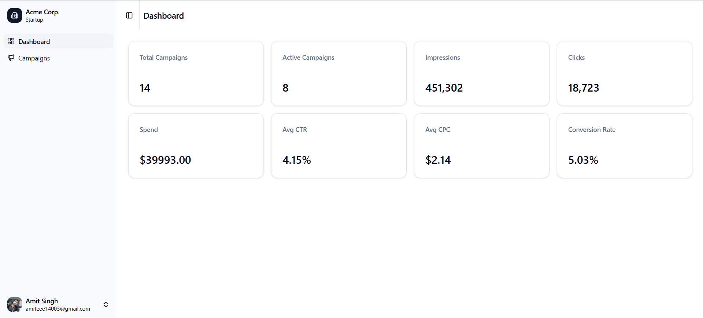
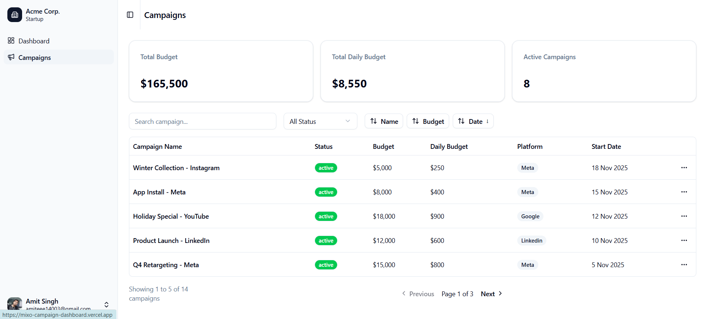
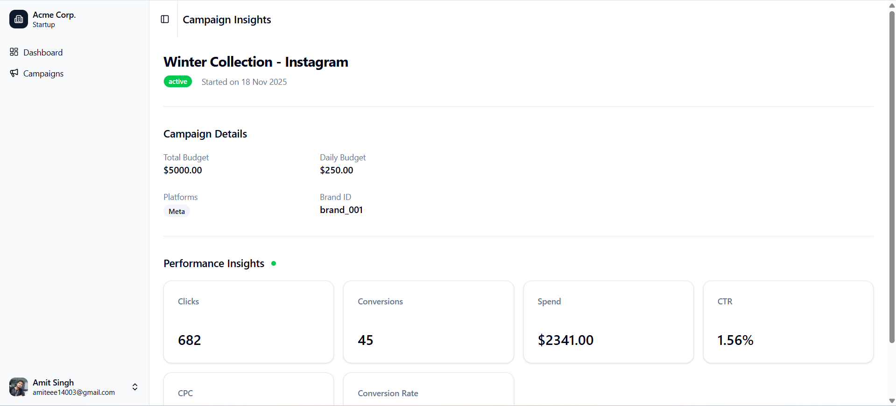

This is a [Next.js](https://nextjs.org) project bootstrapped with [`create-next-app`](https://nextjs.org/docs/app/api-reference/cli/create-next-app).

## Screenshots





## Run the project Locally

This guide explains how to set up and run the project locally.

Clone the repository and install dependencies:

```bash
git clone https://github.com/amitsinghthapliyal/mixo-campaign-dashboard.git
cd mixo-campaign-dashboard
npm install
```

Create a file named .env.local in the project root

```bash
NEXT_PUBLIC_API_BASE_URL= <Replace the URL with your backend API base URL.>
```

Start the development server:

```bash
npm run dev
```

The app will be available at:http://localhost:3000

## Learn More

To learn more about Next.js, take a look at the following resources:

- [Next.js Documentation](https://nextjs.org/docs) - learn about Next.js features and API.
- [Learn Next.js](https://nextjs.org/learn) - an interactive Next.js tutorial.

You can check out [the Next.js GitHub repository](https://github.com/vercel/next.js) - your feedback and contributions are welcome!

## Deploy on Vercel

The easiest way to deploy your Next.js app is to use the [Vercel Platform](https://vercel.com/new?utm_medium=default-template&filter=next.js&utm_source=create-next-app&utm_campaign=create-next-app-readme) from the creators of Next.js.

Check out our [Next.js deployment documentation](https://nextjs.org/docs/app/building-your-application/deploying) for more details.
